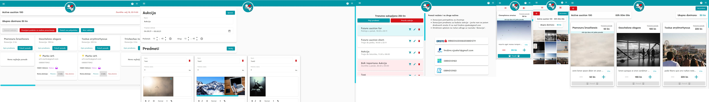

# What is Brave Snouts

[Brave Snouts is animal rescue non profit organization](https://www.facebook.com/hrabrenjuske)

Brave Snouts often organize auctions on which they place items that they collected or were donated to them up for sale so people can bid on them and once it's over highest bidder wins the item and the money goes to organization to help animals get food, shelter and necessary vet treatments.

This task which was usually made on facebook is a bit gruelsome to organize and hard to keep track of. So I developed this small application to help them with just that -> **_auctions_**.

There will possibly be future plans or turning this into their official public website and displaying aggregated data from social media but that is **_TBD_**.

If you wish to contribute please contact me by mail

<b>So far raised over 60 000€ through the app which can handle large amount of auction items and over 2000 users active at a time</b>

**While costing next to nothing to host, maintain and be active**

Resuce organization has _10 000+ organic followers_

Website has ~2200 organic active users per auction at the moment

[Production](https://hrabrenjuske.hr)

[Development](https://bravesnoutsdev.firebaseapp.com/)

# Preview

[More images here](https://github.com/maranmaran/BraveSnouts/tree/main/images)

# Application

Anyone can visit the page and participate in auction.
You can authenticate in the application via Google and Facebook.
Application only requires name, mail and profile picture permissions.

If you are the current highest bidder you will have a star on the item that marks you the highest bidder.
Application keeps track of bids and will notify you via email when you are outbidded. You can opt out of this.

Once the auction is done, app will automatically send email with item winnings to highest bidders along with payment information.
In development: Inform facebook authenticated users via facebook messenger.

# Developer notes

This app is developed with angular 11+ and firebase as backend server / database.
It consumes firebase firestore, auth, storage, functions.

## Deployment

At the moment two projects exist in firebase  
One is **dev** and other is **prod**

Environments are generated dynamically through src/environments/set-env.script.ts
Add your .env file with appropriate keys for environments to generate

### Web app

#### Development

- `ng build` if you wish to debug otherwise `ng build -c development`
- `firebase use dev`
- `firebase deploy --only hosting -P dev`

#### Production

- `ng build -c production`
- `firebase use prod`
- `firebase deploy --only hosting -P prod`

### Functions

#### Development

- `firebase use dev`
- `firebase deploy --only functions -P dev`

#### Production

- `firebase use prod`
- `firebase deploy --only functions -P prod`

## Serving locally

Serve locally with `npm run start`

It will use `local` build configuration upon `ng serve` and replace environment with
dev environment but use source maps and all the standard local development ng serve would use.

Make sure you have appropriate `.env` file

**Firebase:**

- FIREBASE_API_KEY
- FIREBASE_AUTH_DOMAIN
- FIREBASE_PROJECT_ID
- FIREBASE_STORAGE_BUCKET
- FIREBASE_MESSAGING_SENDER_ID
- FIREBASE_APP_ID
- FIREBASE_MEASUREMENT_ID

**App settings:**

- APP_MIN_BID_OFFSET
- APP_MAX_BID_OFFSET
